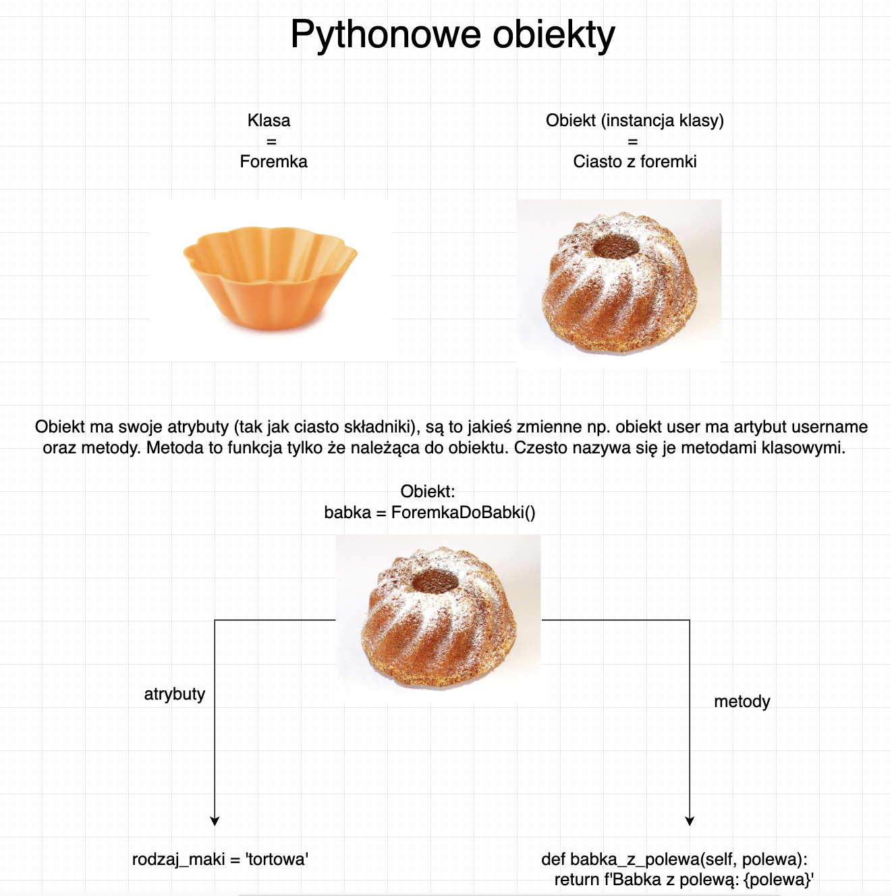
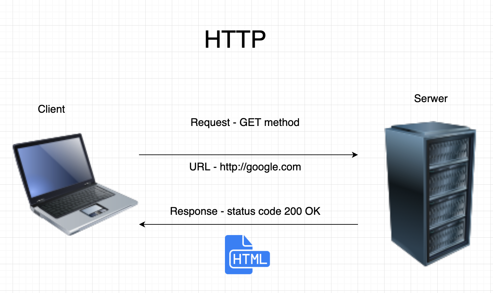
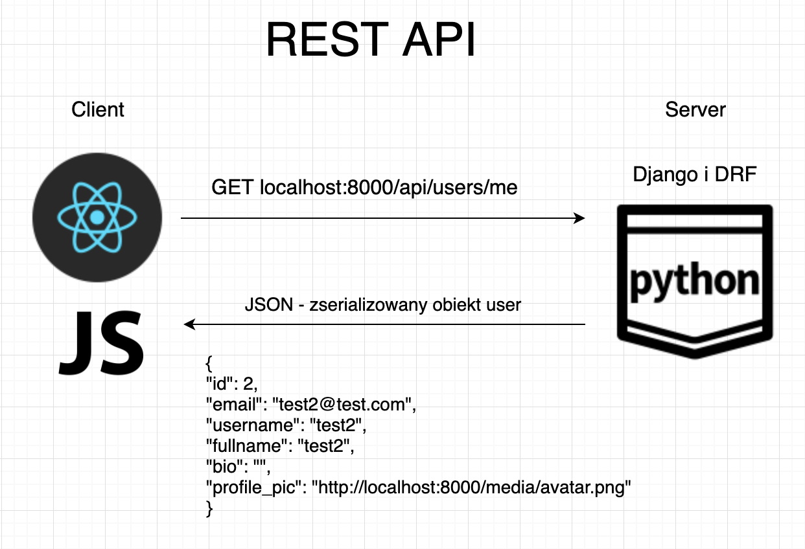
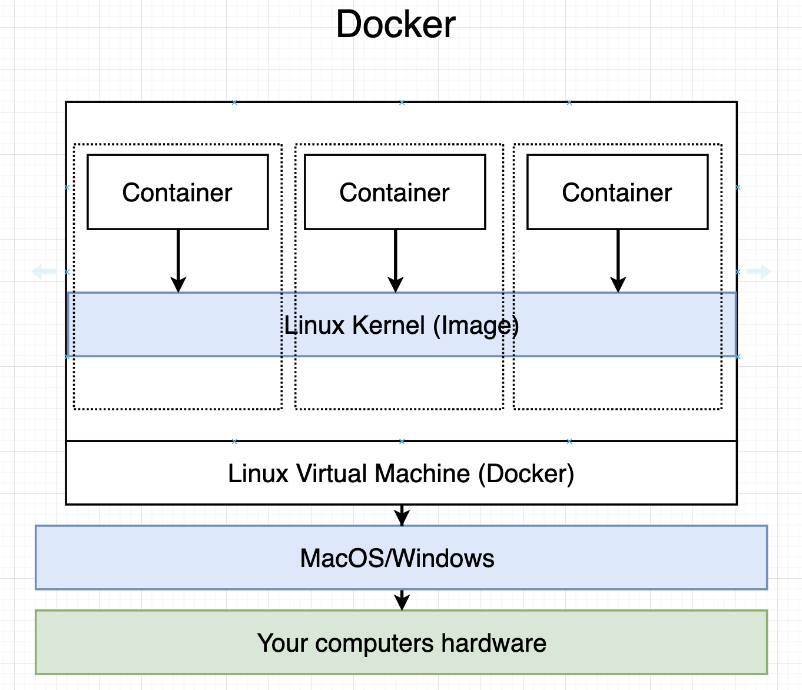

Zanim zaczniemy trochę teori. Opowiedzmy sobie:

- co to znaczy ze w pythonie wszystko jest obiektem
- jak działa dziedziczenie
- czym jest protokół HTTP i po co będzie nam potrzebny
- czym jest API i REST
- co to Docker i jakie będzie jego zadanie w naszym projekcie
- jak kiedyś budowano strony przy użyciu Django
- jak obecnie buduję się aplikacje przy użyciu Django i DRF

Zacznijmy jednak od szybkiego zdefiniowania pojęć, które często będą padały podczas warsztatów:

- klient, serwer - klient to nasza przeglądarka a serwer to maszyna, do której wysyłamy żądania
- endpoint - URL po stronie serwera


## Co to znaczy ze w Pythonie wszystko jest obiektem

Bardzo często mówi się ze w pythonie wszystko jest obiektem ale co to tak naprawdę znaczy? Oznacza to, że wszystko pochodzi od jakieś klasy czyli jest instancją klasy. Bardzo fajnie obrazuję to przykład z foremka i ciastem - foremka to klasa a ciasto z tej foremki to instacja klasy czyli obiekt. Obiekty mają swoje atrybuty i metody. Atrybut to zmienna (czyli obiekt w obiekcie :) ) a metoda to funkcja tylko ze należąca do instancji. Trudne ? Spójrzmy na poniższy diagram:




## Obiektowość

- obiektowość to bardzo rozległy temat, dlatego póki co chciałbym upewnić się ze wszyscy wiecie co robi taki kod.

```python
class Wheel:
    def __init__(self):
        self.shape = 'circle'


class Car(Wheel):
    pass


class Bike(Wheel):
    pass
```

Jest to przykład bardzo często występującego w programowaniu dziedziczenia. Jak wiemy samochód jak i rower mają opony więc żeby nie musieć pisać tego samego kodu wiele razy robimy z opony osobną klase a następnie dziedziczymy po niej wtedy klasa Car i Bike będą miały wszystko co ma w sobie klasa Wheel.


## HTTP

- HTTP to protokół definujący jak wymieniane są informacje w sieci pomiędzy klientem (naszym komputerem/przeglądarka) a serwerem.


- Nas najbardziej będą interesować metody http oraz kody statusów zwracanych przez serwer. Najważniejsze metody i statusy to:

    - metoda GET - kiedy chcemy pobrać jakieś dane, np. kiedy wchodzimy pierwszy raz na strone klikając enter po wpisaniu URL wysyłamy żadanie GET. Jeśli nasze żądanie się powiedzie otrzymujemy status code 200 Ok.
    - metoda POST - kiedy chcemy wysłać dane, np. klikając 'Wyślij formularz' z wypełnionymi danymi. Jeśli nasze żądanie się powiedzie otrzymujemy status code 201 Created.
    - metoda PUT i PATCH - kiedy chcemy zupdatować jakieś dane. PUT aktualizuje cały obiekt a PATCH to inaczej 'partial update' czyli może akutalizować tylko wybrane pola. Jeśli nasze żądanie się powiedzie otrzymujemy status code 200 Ok.
    - metoda DELETE - do usuwania danych. Jeśli nasze żądanie sie powiedzie otrzymujemy status code 204 No content.
    - status 200 Ok - żądanie powiodło się. 
    - status 201 Created - żądanie powiodło się, obiekt został stworzony
    - status 204 No content - żadanie powiodło się, obiekt został usuniety
    - status 400 Bad request - żadnie nie powiodło się
    - status 401 Unauthorized - brak autoryzacji (kiedy jesteśmy niezalogowani)
    - status 403 Forbidden - brak uprawnień
    - status 404 Not Found - chyba wszystkim znany :)



## API, REST i JSON

- Application Program Interface a w naszym przadku dokładniej Web API będzie definować cała logike naszej aplikacji. Angielska definicja API mowi "API is a set of routines, protocols, and tools for building software applications. It specifies how software components should interact".
- REST jest stylem architektury API która korzysta z protokołu i metod HTTP.

Z racji ze nie jestem fanem regułek i sam musiałem to wygooglować na tym pozostawiny defincje. Niedługo sami przekonacie się co to API i jak wygląda "od środka"

- W naszej aplikacji bedziemy posługiwać sie JavaScript Object Notation (JSON) do wymiany danych pomiędzy backendem a frontendem. Po co nam JSON ? Otóż w pythonie wszystko jest obiektem (o czym zaraz) a my bedziemy chcieli nadać tym obiektom postać podobną do pythonowych słowników czyli zserializować je. Przykład jsona w naszej aplikacji:



## Docker

- Docker to narzędzie które uruchamia wirtualny system a w tym systemie można uruchamiać aplikacje (kontenery). Został stworzony żeby tworzenie i wdrażanie aplikacji było łatwiejsze, dzięki niemu aplikacje z jej wszystkimi zależnościami można spakować w "paczke" czyli image. To pozwala nam na unikniecie wielu problemów ponieważ zapewnia ze środowisko zawsze będzie takie same, niezależnie od systemu bazowego maszyny.
- Docker-compose jest narzędziem do definiowania i odpalania wielokontenerowych Dockerowych aplikacji (inaczej wielu image'ów dockerowych)

W naszej aplikacji będziemy korzystali z frontendu przygotowanego wcześniej przez frontendowców i spakowanego do takiej paczki. Jedyne co będziemy musieli zrobić to pobrać tę paczkę i ja uruchomić. Zrobimy to za pomoca jednej komendy `docker-compose up --build`. Już niebawem sami zobaczymy jakie to przyjemne.


Poniższy diagram wizualizuje jak to wszystko się ze sobą łaczy. Podane 3 kontenery to: frontend, backend i baza danych postgres.




## Old way of doing things - Django + HTML + CSS

Jeszcze pare lat temu kiedy frameworki JS'owe nie były tak dobre i popularne aplikacje Django na każdy request wysłany przez klienta odpowiadało renderując plik HTML (jak na slajdzie 'HTTP'). Przykład:

```python
def profile(request, username):
    user = User.objects.get(username=username)

    context = {
        'user': user,
    }
    return render(request, 'profiles/profile.html', context)
```

Funkcja ta zwraca plik HTML do którego przekazuje model user'a by tam wyciągnać z niego dane. Takie podejście niestety było bardzo nie efektywne ponieważ wysyłanie nowego pliku HTML co każde zapytanie wiązało się z duża ilością przesyłanych danych.

## New way of doing things - Django + DRF + JS & HTML & CSS

Kiedy na frontendzie zaczęła panować moda na React'a, Angulara czy Vue do akcji wkroczyło również REST API. Jak już sie pewnie domyślacie zwraca nam ono tylko dane tekstowe w postaci JSON'a w (klucz: watość jak w słowniku). Jest to o tyle fajne ze zbundlowane pliki HTML i CSS możemy wysłać tylko raz a następnie pobierać z odpowiednich endpointów lekkie dane tekstowe. Schemat ten przedstawia slajd 'REST API' wyżej.

Przykład:

```python
class SampleView(APIView):
    def get(self, request):
        data = {'sample': 'sample JSON Response'}
        return Response(data)
```
