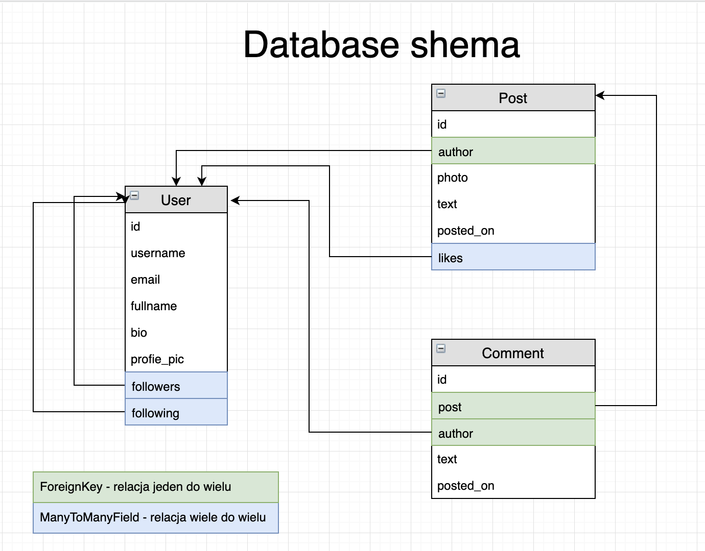

Do zbudowania naszej aplikacji musimy zadać pytanie jakie dane chcemy przechowywać i zwracać na odpowiednich endpointach. Zacznijmy więc od zdefiniowania jakie będziemy mieć modele.

## Database schema

Przypomnijmy sobie wymagania biznesowe aplikacji - ma ona mieć możliwość logowania, rejestracji, zarządzania profilem użytkownika, followania oraz dodawania zdjęć, lajków i komentarzy. To podpowiada nam że na pewno bedziemy mieli do czynienia z modelami: User, Post, Comment, a co z lajkami i folowami ? Możemy je przechowywać w modelach których one dotyczą.

Popatrzmy na poniższy model bazy danych który dostaliśmy od architekta i omówmy go:

## Django + DRF workflow for building endpoints

Budowanie nowych funkcjonalności można sprowadzić do takiego schematu:

Zaczynająć od końca najpierw implementujemy model ze wszystkim jego polami, następnie serializer w którym precyzujemy jakie pola np. z modelu chcemy serializować i zwracać, potem we views'ach piszemy widok w którym określamy z jakiego serializera i metod HTTP ma korzystać. Na końcu dodajemy tylko ścieżke w urls i endpoint jest gotowy.

## Viewsy dostarczone przez DRF 

1. APIView - pozwala na pisanie customowych widoków, niezwiązanych z modelami (aczkowiek jest to możliwe jeśli chcemy). Operuje na metodach `.get(), .post(), put(), patch() and .delete()`.

2. Generic views - generyczne widoki dostarczające czesto potrzebne rozwiązania do zwracania listy obiektów, szczegołów obiektu oraz róznych metod HTTP do wykonywania na konkretnym modelu. Jest wiele klas generycznych i każda wykonuje jakieś konkretne działanie.

3. Viewsets - dostarcza w jednej klasie wszystkie metody na konkretnym modelu.

To wszystko jest w [dokumentacji DRF](https://www.django-rest-framework.org/). Zachęcamy zajrzeć tam i grubasza rozeznać się co oferuje nam framework. 

Przejdzmy dalej i napiszmy pierwszy kod.