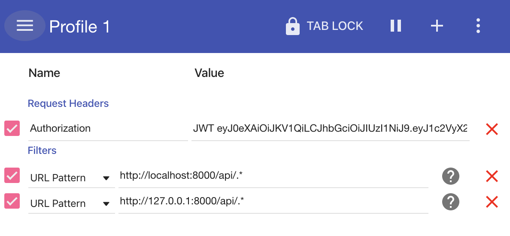

Przejdzmy wreszcie do implementacji naszego pierwszego modelu. Ten rozdział przeznaczony jest do części wykładowej w związku z czym  możecie przepisywać bądz kopiować kod. Naszym celem będzie omówienie, zrozumienie go i odwoływanie się do niego w celu referencji w późniejszych zadaniach. W dalszej części warsztatów przewidziane jest samodzielne wykonanie zadań.

## Models

Na pierwszy ogień malutki model User. 

```python
from django.db import models
from django.contrib.auth.models import AbstractUser


class User(AbstractUser):
    email = models.EmailField(max_length=255, unique=True)
    fullname = models.CharField(max_length=60, blank=True)
    bio = models.TextField(blank=True)
    profile_pic = models.ImageField(default='avatar.png')

    def __str__(self):
        return self.username
```

Najważniejszą kwestią w modelu User jest to że dziedziczy on po klasie `AbstractUser` czyli rozbudowanym modelu User'a dostarczonym przez Django. Wejdzmy w tę klasę i rozejrzyjmy się. Nas najbardziej interesują dwa pola jakie dostarcza: `username` oraz `email`. Po którtkiej analizie dochodzimy do wniosku że pole username spełnia nasze wymagania ale pole email nie posiada atrybutu `unique` dlatego też to pole nadpiszemy. Ponadto dodamy pola `fullname, bio, profile_pic`.

Gdy mamy uzupełniony model stwórzmy plik migracyjny i odpalmy migracje:
```
python manage.py makemigrations
python manage.py migrate
```

Na endpointach REST API chcemy zwracać zserializowane dane w związku z tym napiszmy serializer w nowo utworzonym pliku `serializers.py`. Zaimplenetujmy najpierw ten odpowiedzialny za rejestrację nowych użytkowników:

```python
from django.contrib.auth import get_user_model
from rest_framework import serializers

User = get_user_model()


class RegisterUserSerializer(serializers.ModelSerializer):
    class Meta:
        model = User
        fields = ('id', 'email', 'fullname', 'username', 'password')
        extra_kwargs = {
            'password': {'write_only': True, 'min_length': 5},
            'username': {'min_length': 3},
        }

    def create(self, validated_data):
        return User.objects.create_user(**validated_data)
```

Dziedziczymy tutaj po klasie `serializers.ModelSerializer` dostarczonej przez rest_framework dzięki której możemy odwołać sie do opowiedniego modelu i sprecyzować jakie pola mają zostać zserializowane. Dostarcza ona również metody do tworzenia (create) i aktualizowania obiektu (update). My nadpiszemy metodę create zeby zwracała nowo stworzonego usera. W pliku views.py do którego zaraz przejdziemy sprecyzujemy że chcemy korzystać tylko z metody create.

Przechodzimy do viewsów:

```python
from rest_framework import generics, permissions
from users.serializers import RegisterUserSerializer


class RegisterUserView(generics.CreateAPIView):
    serializer_class = RegisterUserSerializer
    permission_classes = (permissions.AllowAny,)
```

Jak widać tyle linijek kody wystarczy by stworzyć nowy widok. Dziedziczmy tutaj po klasie `generics.CreateAPIView` która jak sama nazwa wskazuje pozwala na tworzenie, ponadto określamy atrybuty serializer_class i permission_classes.

Teraz pozostało juz tylko zarejestrować widok w pliku urls.py:

```python
from django.urls import path

from rest_framework_jwt.views import obtain_jwt_token

from users.views import RegisterUserView

app_name = 'users'

urlpatterns = [
    path('register/', RegisterUserView.as_view(), name='register'),
    path('login/', obtain_jwt_token, name='login'),
]
```

no i jeszcze załączmy powyższe urls'y w głównym pliku instagram/ulrs.py oraz podłaczmy lokalizacje plików statycznych

```python
from django.contrib import admin
from django.urls import path, include
from django.conf.urls.static import static
from django.conf import settings

urlpatterns = [
    path('admin/', admin.site.urls),
    path('api/users/', include('users.urls')),
] + static(settings.MEDIA_URL, document_root=settings.MEDIA_ROOT)
```

Co ciekawe rozszerzenie djangorestframework-jwt dostarcza nam 'out of the box' rozwiazanie do logowania użytkowników. Dokładniej jest to funkcja `obtain_jwt_token` - będzie ona zwracała token JWT którym możemy się potem zalogować.

Sprawdzmy teraz w aplikacji frontendowej na localhost:3000 czy wszystko działa. Zarejestrujmy nowego użytkownika a potem zalogujmy się nim. 

To samo sprawdzmy na backendzie - wjedzmy na endpoint `localhost:8000/api/users/register` a następnie `localhost:8000/api/users/login`. By móc być zalogowanym na porcie 8000 i korzystać z interfejsu graficznego DRF'a dodajmy Authorization header z otrzymanym tokenem we wtyczce do Chrome'a - ModHeaders:



Super mamy juz rejestracie i logowanie ! Dopiszmy jeszcze funkcjonalność zarządania profilem użytkownika. Model już mamy, zaczynamy więc od serializera, napiszmy:

```python
class UserSerializer(serializers.ModelSerializer):
    class Meta:
        model = User
        fields = (
            'id',
            'email',
            'username',
            'password',
            'fullname',
            'bio',
            'profile_pic',
        )
        extra_kwargs = {
            'password': {'write_only': True, 'min_length': 5},
            'username': {'min_length': 3},
        }

    def update(self, instance, validated_data):
        password = validated_data.pop('password', None)
        user = super().update(instance, validated_data)

        if password:
            user.set_password(password)
            user.save()

        return user
```

Jak już wspomnialiśmy `serializers.ModelSerializer` dostarcza metody create oraz update, tutaj nadpisujemy metodę update dostosowująć ją do naszych potrzeb tj. ustawiamy hasło metodą `set_password` by było ono zahashowane.

Lecimy do viesów, tym razem skorzytamy z `generics.RetrieveUpdateDestroyAPIView` służącego do czynności podanych w nazwie klasy. By powiedzieć klasie jakiego dokładnie obiektu musi poszukać dodajemy metodę `get_object` która zwraca użytkownika którym wysłał zapytanie (request): 

```python
from users.serializers import RegisterUserSerializer, UserSerializer

...

class UserView(generics.RetrieveUpdateDestroyAPIView):
    serializer_class = UserSerializer

    def get_object(self):
        return self.request.user
```

i dodajemy nowy path: 

```python
...
from users.views import RegisterUserView, UserView

app_name = 'users'

urlpatterns = [
    path('register/', RegisterUserView.as_view(), name='register'),
    path('login/', obtain_jwt_token, name='login'),
    path('me/', UserView.as_view(), name='me'),
]
```

Gratulacje świetnie nam idzie! Sprawdzmy zatem nasz nowy endpoint. Pamietaj dodać Authorization header we wtyczce ModHeaders.

Wracająć do frontendu, jak widzicie możemy dostać się na feed page. A zauważyliscie może ze nie ładuje nam sie logo usera ? Jak wejdziemy w dev toolsy w Network tab możemy zwrocić uwage że nasz frontend wysyła tylko request na /feed, skąd zatem mamy username i inne dane a avatar nie. Tutaj wkracza ciekawa właściwość JWT - możemy zakodować w nim payload czyli jakies dane które nastepnie odkodujemy na frontendzie. Defaultowo zakodowany jest tylko username ale możemy to zmienić. Stworzmy w projekcie nowy folder utils a w nim plik `jwt_payload.py`

Plik jwt_payload.py:

```python
from datetime import datetime

from rest_framework_jwt.settings import api_settings


def jwt_payload_handler(user):
    """Slightly customized jwt payload that include user profile picture"""

    payload = {
        'user_id': user.pk,
        'username': user.username,
        'fullname': user.fullname,
        'profile_pic': user.profile_pic.url,
        'exp': datetime.utcnow() + api_settings.JWT_EXPIRATION_DELTA,
    }

    return payload
```

Potem zarejestrujmy to w settingsach, na górze pliku dodajmy import a na samym dole ustawienia JWT_AUTH:

```python 
from datetime import timedelta
```
```python
# JWT
JWT_AUTH = {
    'JWT_EXPIRATION_DELTA': timedelta(hours=36),
    'JWT_PAYLOAD_HANDLER': 'utils.jwt_payload.jwt_payload_handler',
}
```

Przelogujmy się i sprawdzmy czy tym razem avatar jest widoczny.

Najtrudniejsze mamy już za sobą, przejdziemy teraz to napisania paru prostych testów do naszych endpointów.